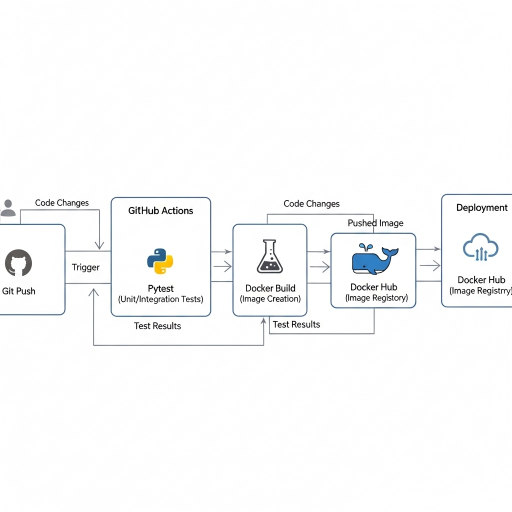

# Scalable ML Service: Ad Sales Prediction with CI/CD & MLflow

This repository contains a complete, production-ready MLOps pipeline for a machine learning prediction service. The project demonstrates the entire lifecycle of an ML system: from cleaning messy, real-world data to training and tracking a model, containerizing the prediction API, and automating the entire process with a CI/CD pipeline.

The primary goal of this project is to showcase enterprise-level MLOps best practices, including automated testing, version control, experiment tracking, and automated deployment.

---

## 🚀 Key Features

*   **End-to-End Data Pipeline:** A robust data cleaning and feature engineering pipeline built with Pandas to handle messy, inconsistent real-world data.
*   **Experiment Tracking:** Uses **MLflow** to log model parameters, metrics (RMSE, R²), and save model artifacts, ensuring full reproducibility.
*   **Model Registry:** Leverages the MLflow Model Registry to version models and manage their lifecycle (e.g., promoting to "Production").
*   **Containerized API:** The prediction service is a lightweight **Flask** API, containerized with **Docker** for maximum portability and scalability.
*   **Automated CI/CD Pipeline:** A full Continuous Integration / Continuous Deployment pipeline using **GitHub Actions** that automatically:
    1.  Runs **Pytest** unit tests on every push to `main`.
    2.  Builds the Docker image.
    3.  Pushes the validated image to **Docker Hub**.

---

## 🏗️ Architecture

The diagram below illustrates the complete CI/CD and MLOps workflow for this project.



---

## 🛠️ Tech Stack

*   **ML & Data Science:** Python, Pandas, Scikit-learn
*   **MLOps & Experiment Tracking:** MLflow
*   **Backend & API:** Flask, Gunicorn
*   **Containerization:** Docker
*   **CI/CD & Automation:** GitHub Actions, Pytest
*   **Container Registry:** Docker Hub

---

## 🏁 How to Run

### 1. Run the Docker Container Locally

Once you have Docker installed and running, you can run the entire application with a single command. This will pull the pre-built image from Docker Hub.

```bash
# Pull the latest image from Docker Hub
docker pull mdehsanulhaquekanan/scalable-ml-service:latest

# Run the container (replace C:\path\to\your\project with the absolute path to your project folder)
# This command mounts a local 'mlruns' folder into the container to load the model
docker run -p 5001:5001 -v "C:\path\to\your\project\mlruns:/app/mlruns" mdehsanulhaquekanan/scalable-ml-service
```

### 2\. Test the API

With the container running, you can send a POST request to the prediction endpoint using the provided test\_api.py script or a tool like cURL/Postman.

```bash
python test_api.py   
```

**Expected Response in JSON:**

```bash
{
  "sale_amount_prediction": 1567.1 
}
```

🧪 CI/CD Pipeline
-----------------

The CI/CD pipeline is defined in .github/workflows/ci-cd.yml and is triggered on every push to the `main` branch.

 


The pipeline performs the following steps:

1.  **Code Checkout:** Checks out the latest version of the code.
    
2.  **Dependency Installation:** Installs all necessary Python libraries.
    
3.  **Unit Testing:** Runs the pytest suite to ensure code quality and correctness.
    
4.  **Docker Build & Push:** If tests pass, it builds the Docker image and pushes it to Docker Hub.