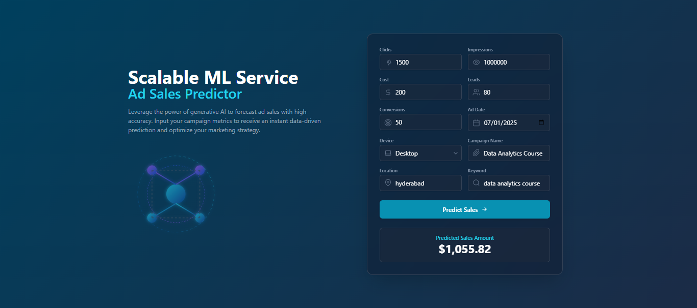
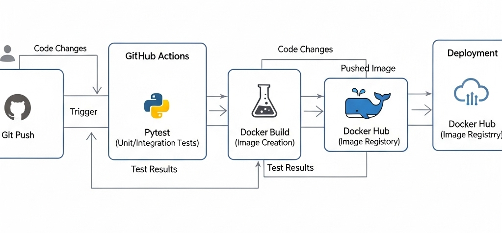

# Scalable ML Service: Ad Sales Prediction with CI/CD & MLflow

This repository contains the complete, production-ready MLOps backend for a machine learning prediction service. The project demonstrates the entire lifecycle of an ML system: from cleaning messy, real-world data to training a model, containerizing the API, and automating the testing and build process with a CI/CD pipeline.

This backend serves a decoupled, modern React/TypeScript frontend hosted on Vercel.

---

**[➡️ Live Frontend Demo on Vercel](https://ad-sales-predictor-frontend.vercel.app/)** | **[📂 Frontend Source Code](https://github.com/MdEhsanulHaqueKanan/ad-sales-predictor-frontend)**

*(Note: The backend server on Render's free tier may take up to a minute to "wake up" on the first visit.)*

---

## ✨ Demo Screenshot


---

## 🚀 Key Features

*   **Headless API Backend:** A pure prediction API built with **Flask** and served by a production-ready **Gunicorn** WSGI server.
*   **Containerized & Scalable:** The entire application is containerized with **Docker**. Its **stateless design** ensures horizontal scalability.
*   **Automated CI/CD Pipeline:** A full Continuous Integration pipeline using **GitHub Actions** that automatically:
    1.  Runs **Pytest** unit tests on every push to `main`.
    2.  Builds the Docker image if tests pass.
    3.  Pushes the validated image to **Docker Hub**.
*   **Robust Data Processing:** The service includes a complete data cleaning and feature engineering pipeline using a scikit-learn compatible transformer, packaged into a single `joblib` artifact.

---

## 🏗️ Full-Stack Architecture

This backend is part of a decoupled, full-stack application. The complete MLOps and deployment workflow is illustrated below.



---

## 🛠️ Tech Stack

*   **ML & Data Science:** Python, Pandas, Scikit-learn, Joblib
*   **Backend & API:** Flask, Gunicorn, Flask-Cors
*   **Containerization:** Docker
*   **CI/CD & Automation:** GitHub Actions, Pytest
*   **Container Registry:** Docker Hub
*   **Deployment:** Render

---

## 🏁 Getting Started Locally

### Prerequisites
*   Git
*   Docker Desktop

### 1. Clone the Repository
```bash
git clone https://github.com/MdEhsanulHaqueKanan/Scalable-ML-Service-Ad-Sales-Prediction-with-CI-CD-and-MLflow.git
cd Scalable-ML-Service-Ad-Sales-Prediction-with-CI-CD-and-MLflow
```

### 2. Run the Docker Container

You can run the application using the pre-built image from Docker Hub.

**On Windows (Command Prompt):**
```bash
docker pull mdehsanulhaquekanan/scalable-ml-service:latest
docker run -p 5001:5001 mdehsanulhaquekanan/scalable-ml-service
```

**On macOS / Linux:**
```bash
docker pull mdehsanulhaquekanan/scalable-ml-service:latest
docker run -p 5001:5001 mdehsanulhaquekanan/scalable-ml-service
```
### 3. Access the Application
Once the container is running, open your web browser and navigate to http://127.0.0.1:5001. You should see: 
```bash
{"status":"API is running"}.
```

---


## 🧪 Testing the API
With the container running, you can send a POST request to the /predict endpoint using a simple Python script.

```bash
# test_api.py
import requests
import json

# For local testing
# url = 'http://127.0.0.1:5001/predict'

# For testing the live Render deployment
url = 'https://scalable-ad-sales-predictor.onrender.com/predict'

sample_data = {
    "Campaign_Name": "Data Analytics Course", "Clicks": 150,
    "Impressions": 5000, "Cost": "$200", "Leads": 20, "Conversions": 10,
    "Ad_Date": "2025-07-24", "Location": "hyderabad", "Device": "desktop",
    "Keyword": "data analytics course"
}

response = requests.post(url, json=sample_data)

print(f"Status Code: {response.status_code}")
print(f"Response JSON: {response.json()}")  
```
 
---

## 🤖 CI/CD Pipeline

The CI/CD pipeline ensures that only tested and validated code is published as a new Docker image to Docker Hub.

**Pipeline Status:**  


---
Developed by Md. Ehsanul Haque Kanan