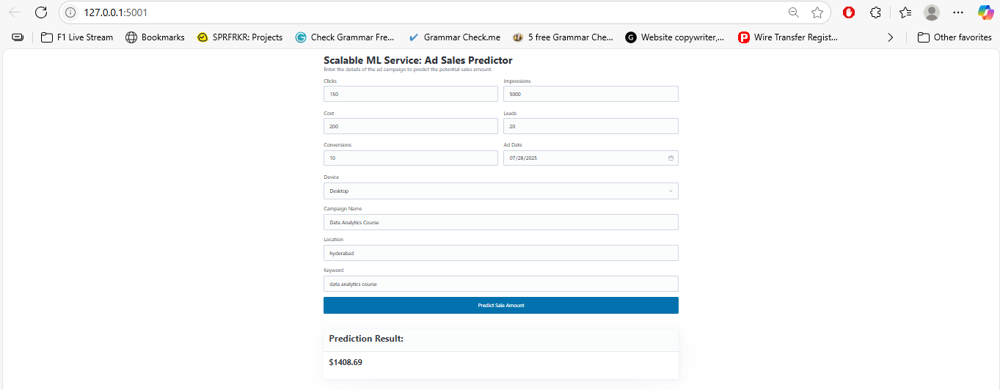

# Scalable ML Service: Ad Sales Prediction with CI/CD & MLflow

This repository contains a complete, production-ready MLOps pipeline for a machine learning prediction service. The project demonstrates the entire lifecycle of an ML system: from cleaning messy, real-world data to training and tracking a model, containerizing the prediction API, and automating the entire process with a CI/CD pipeline.

The primary goal of this project is to showcase enterprise-level MLOps best practices, including automated testing, version control, experiment tracking, and automated deployment.

---

## ✨ Demo Screenshot

The project features a clean, interactive user interface built with Flask and styled with Pico.css.



---

## 🚀 Key Features

*   **End-to-End Data Pipeline:** A robust data cleaning and feature engineering pipeline built with Pandas to handle messy, inconsistent real-world data.
*   **Experiment Tracking & Model Registry:** Uses **MLflow** to log model parameters, metrics (RMSE, R²), and manage the model lifecycle by promoting validated versions to "Production".
*   **Interactive Frontend:** A user-friendly web interface built with **Flask**, HTML, and vanilla JavaScript that allows for real-time predictions.
*   **Containerized & Production-Ready:** The entire application is containerized with **Docker** and served by a Gunicorn WSGI server for maximum portability and scalability.
*   **Automated CI/CD Pipeline:** A full Continuous Integration pipeline using **GitHub Actions** that automatically:
    1.  Runs **Pytest** unit tests on every push to `main`.
    2.  Builds the Docker image if tests pass.
    3.  Pushes the validated image to **Docker Hub**.

---

## 🏗️ Architecture

The diagram below illustrates the complete CI/CD and MLOps workflow for this project.


---

## 🛠️ Tech Stack

*   **ML & Data Science:** Python, Pandas, Scikit-learn
*   **MLOps & Experiment Tracking:** MLflow
*   **Backend & API:** Flask, Gunicorn
*   **Frontend:** HTML, CSS, JavaScript
*   **Containerization:** Docker
*   **CI/CD & Automation:** GitHub Actions, Pytest
*   **Container Registry:** Docker Hub

---

## 🏁 Getting Started

### Prerequisites
*   Git
*   Docker Desktop

### 1. Clone the Repository
```bash
git clone https://github.com/MdEhsanulHaqueKanan/Scalable-ML-Service-Ad-Sales-Prediction-with-CI-CD-and-MLflow.git
cd Scalable-ML-Service-Ad-Sales-Prediction-with-CI-CD-and-MLflow
```

### 2. Run the Docker Container

You can run the application using the pre-built image from Docker Hub.

**On Windows (Command Prompt):**
This command mounts your local mlruns folder into the container to load the model.

```bash
docker pull mdehsanulhaquekanan/scalable-ml-service:latest
docker run -p 5001:5001 -v "%cd%\mlruns:/app/mlruns" mdehsanulhaquekanan/scalable-ml-service
```

**On macOS / Linux:**
```bash
docker pull mdehsanulhaquekanan/scalable-ml-service:latest
docker run -p 5001:5001 -v "$(pwd)/mlruns:/app/mlruns" mdehsanulhaquekanan/scalable-ml-service
```
### 3. Access the Application
Once the container is running, open your web browser and navigate to:
```bash
http://127.0.0.1:5001
```

## 🧪 Testing the Service
### Unit Tests

The project includes a suite of unit tests for the data processing pipeline. You can run these locally using `pytest`:

```bash
pytest   
```

### API Test
With the container running, you can send a `POST` request to the prediction endpoint. Create a file named `test_api.py` with the following content and run python `test_api.py`.
```bash
# test_api.py
import requests
import json

url = 'http://127.0.0.1:5001/predict'

sample_data = {
    "Campaign_Name": "Data Analytics Course", "Clicks": 150,
    "Impressions": 5000, "Cost": "$200", "Leads": 20, "Conversions": 10,
    "Ad_Date": "2025-07-24", "Location": "hyderabad", "Device": "desktop",
    "Keyword": "data analytics course"
}

response = requests.post(url, json=sample_data)

print(f"Status Code: {response.status_code}")
print(f"Response JSON: {response.json()}")
```
**Expected Response in JSON:**

```bash
{
  "sale_amount_prediction": 1376.11 
}
```


---

## 🤖 CI/CD Pipeline

The CI/CD pipeline is defined in `.github/workflows/ci-cd.yml` and is triggered on every push to the `main` branch. It ensures that only tested and validated code is deployed as a new Docker image.

**Pipeline Status:**  


---
Developed by Md. Ehsanul Haque Kanan